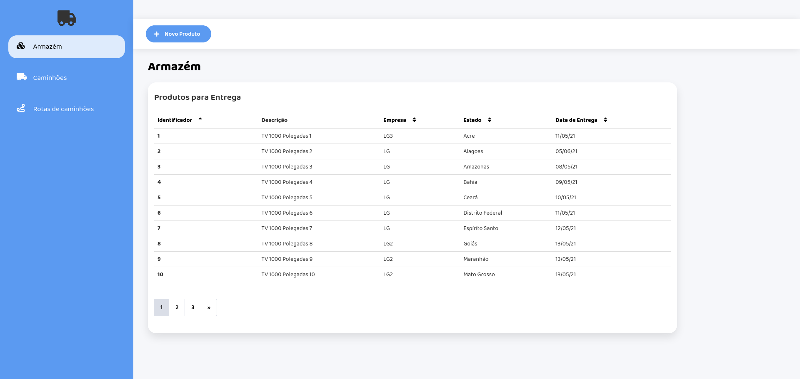
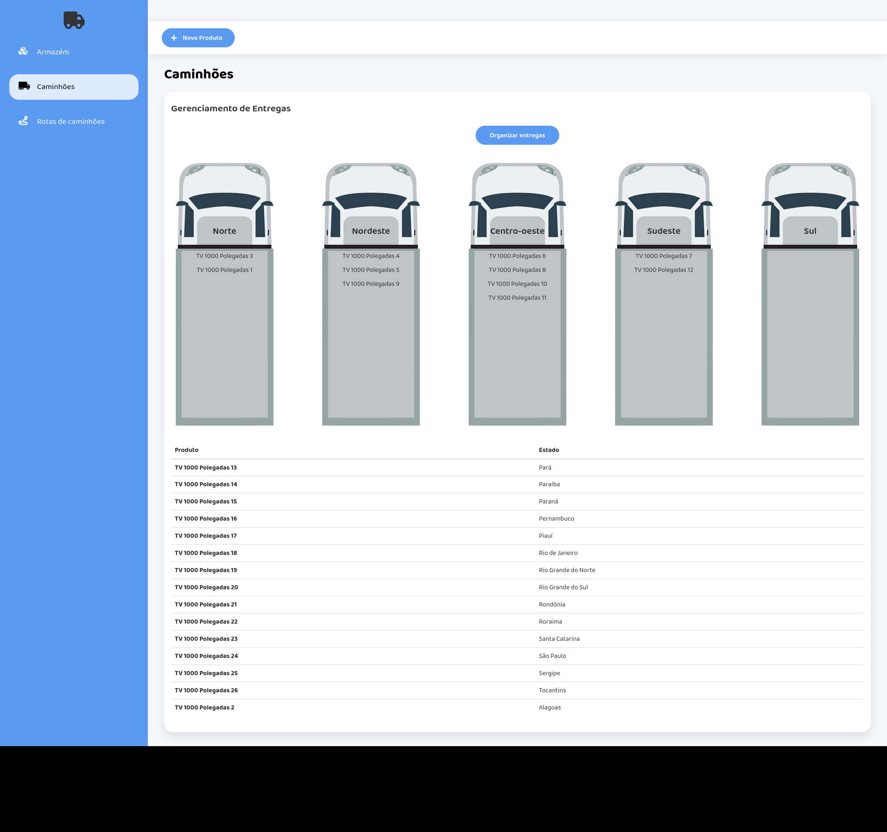
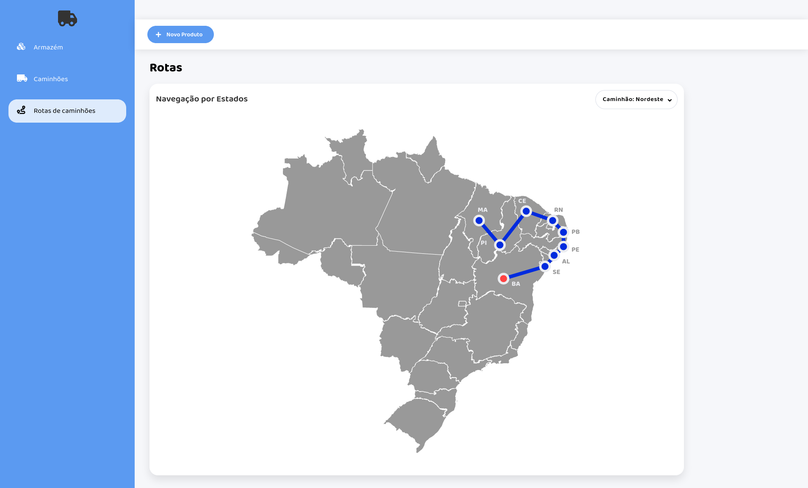

# Entregas

**Número da Lista**: 2<br>
**Conteúdo da Disciplina**: Grafos, Programação Dinâmica e Dividir e Conquistar<br>

## Alunos
|Matrícula | Aluno |
| -- | -- |
| 18/0113666  |  Ítalo Álves Guimarães  |
| 18/0114689  |  Tiago Samuel Rodrigues |

## Sobre 
Este projeto tem como finalidade utilizar algoritmos da disciplina de projeto de algoritmos em uma aplicação real. Nosso aplicação é destinado
a uma distribuidora, com o objetivo de facilitar a gerência de seus produtos e o desenvolvimento das rotas de seus caminhões.

## Screenshots




## Instalação 
**Linguagem**: Javascript<br>
**Framework**: React, Node.js<br>

## Requisitos
yarn ou npm

## Como rodar
1) Navegue até a pasta frontend e rode
```
npm install
npm start
```
ou
```
yarn
yarn start
```

2) Abra outro terminal e navegue até a pasta backend e rode
```
npm install
npm start
```
ou
```
yarn
yarn start
```


